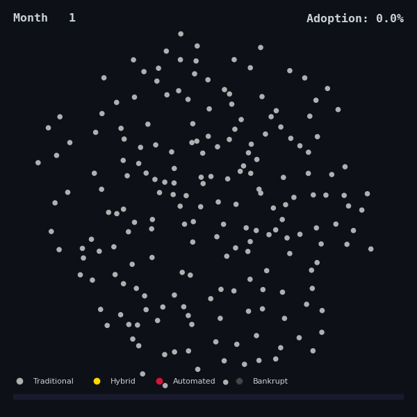
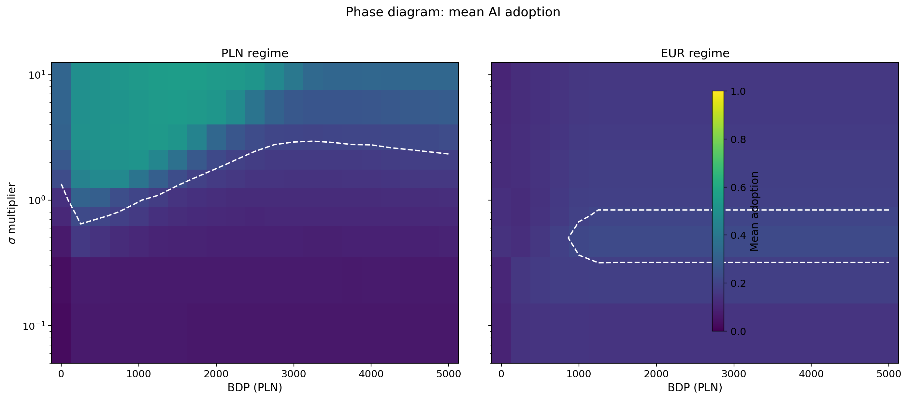
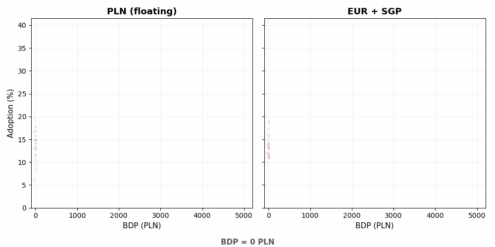

 

# Hi, I'm Maciej

**Quantitative finance & complexity economics**

Building agent-based models of AI-driven labor market transitions — where statistical physics meets macroeconomic policy.

---

## Boom Bust Group

**A quantitative investment firm built by scientists and engineers**

> "We trade global markets through precision, speed, and deep data insights."

---

*(Feel free to visit our website &rarr; [boombustgroup.com](https://www.boombustgroup.com/))*

---

## Complexity Economics Research

A stock-flow consistent agent-based model (SFC-ABM) with **10,000 heterogeneous firms** across **6 sectors**, calibrated to the Polish economy (GUS 2024). Five published papers and **40,000+ Monte Carlo simulations** exploring how universal basic income, monetary regimes, and network topology interact to produce **phase transitions in automation adoption**.

<b>Phase diagram of AI adoption.</b> Left: PLN regime shows reentrant transition — adoption peaks at BDP ~500 PLN then declines as inflation triggers NBP rate hikes. Right: EUR + SGP constraint confines adoption to a narrow island (BDP 1000–3000, low &sigma;).

### Published Papers

| # | Title | Sims | DOI | |
|:-:|-------|-----:|-----|:-:|
| 1 | **The Acceleration Paradox** | 6,300 |  | [PDF](https://github.com/complexity-econ/paper-01-acceleration-paradox/blob/main/latex/paper_en.pdf) |
| 2 | **PLN vs EUR with SGP Constraint** | 1,260 |  | [PDF](https://github.com/complexity-econ/paper-02-monetary-regimes/blob/main/latex/paper_en.pdf) |
| 3 | **Empirical CES &sigma; Estimation** | 120 |  | [PDF](https://github.com/complexity-econ/paper-03-empirical-sigma/blob/main/latex/paper_en.pdf) |
| 4 | **Phase Diagram & Universality** | 18,540 |  | [PDF](https://github.com/complexity-econ/paper-04-phase-diagram/blob/main/latex/paper_en.pdf) |
| 5 | **Endogenous Technology & Network Dynamics** | 10,080 |  | [PDF](https://github.com/complexity-econ/paper-05-endogenous/blob/main/latex/paper_en.pdf) |

**Engine**: [`core`](https://github.com/complexity-econ/core) &mdash; reusable Scala 3 SFC-ABM engine

### Key Findings

- **Acceleration paradox** &mdash; moderate UBI *causes* automation rather than responding to it; bimodal adoption at the critical point (Hartigan dip *p* = 1.7 &times; 10-5)
- **Monetary sovereignty matters** &mdash; PLN float permits the transition; EUR + Stability & Growth Pact kills it (SGP caps effective UBI at ~10 PLN by month 120)
- **&sigma; calibration doesn't** &mdash; 5&ndash;9&times; change in CES elasticity shifts adoption by only 1.5 pp; monetary regime dominates (&Delta; 6 pp)
- **Topology universality** &mdash; BDPc = 500 PLN across all four network topologies (WS, ER, BA, lattice); mean-field critical exponent &gamma; &approx; 1.0
- **Endogenization preserves universality** &mdash; Arthur-style learning + preferential rewiring keep the reentrant shape; BDPc shifts by at most 250 PLN

<b>Bifurcation dynamics.</b> PLN regime (left) exhibits a reentrant peak — adoption rises then falls as fiscal stimulus triggers monetary tightening. EUR regime (right) is capped by Maastricht fiscal rules.

---

### Tech Stack

